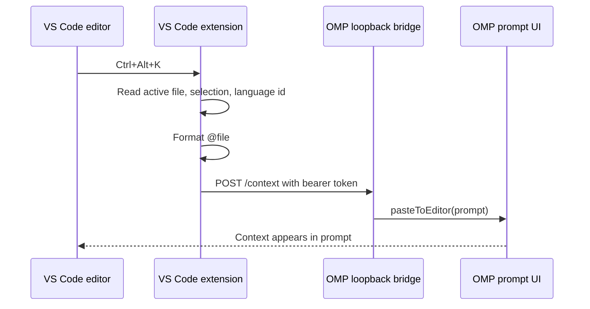

# Concepts

## Intent

**WHY this document exists:** The bridge spans two plugin systems. Future changes need to preserve which side owns editor state, prompt state, and transport security.

**WHAT this document produces:** A compact map of the concepts, request flow, data contract, and known limits.

**Decision Rules:**
- **Editor facts come from VS Code:** Current file, cursor, selection, selected text, and language id are captured by the VS Code extension only.
- **Prompt mutation happens in OMP:** OMP owns the live prompt editor, so prompt insertion uses an OMP runtime extension.
- **Local bridge, not public API:** The HTTP server binds to `127.0.0.1` and requires the token written by the running OMP extension.
- **Inline first:** Default to `@file#LxCy-LxCy` plus selected text so OMP receives the exact bytes. Reference-only mode stays available as the compact saved-file optimization.

## Problem shape

Claude Code and OpenCode feel integrated because the IDE extension knows the editor selection and the agent UI knows how to append to its prompt. OMP has the agent-side extension API, but VS Code still needs a separate extension to read selected text.

This repo is therefore two integrations in one package:

1. VS Code extension: registers `OMP Context: Insert Editor Context` and binds it to `Ctrl+Alt+K` / `Cmd+Alt+K`.
2. OMP extension: starts a loopback bridge and inserts received context into the OMP prompt.

## Runtime flow



## Data contract

The VS Code extension posts JSON to `/context`:

```json
{
  "prompt": "@src/example.ts#L7C17-L9C20 "
}
```

Only `prompt` is sent. VS Code owns editor inspection; OMP only needs the text to paste.

## Content modes

- `inline`: default. Sends `@file#LxCy-LxCy ` plus a fenced copy of the selected text. Safest when the selected bytes matter, or when buffers are unsaved/generated.
- `reference`: sends only `@file#LxCy-LxCy `. Smaller prompt for saved workspace files because OMP can inspect the file directly.

Use `reference` for large selections when you prefer a compact prompt over copying selected text into OMP.


## Prompt repaint compatibility

Older OMP builds can apply `pasteToEditor(prompt)` to the prompt state without repainting the terminal frame until the next keypress. The bridge therefore treats prompt paste as a two-step operation:

1. Call OMP's `pasteToEditor(prompt)` so the normal editor paste path owns cursor/text mutation.
2. Read back editor text for up to a short bounded deadline; once the paste is visible in editor state, request a render without rewriting text when possible.

The preferred repaint nudge is `setStatus("omp-vscode-context", undefined)`: OMP clears that hook status and requests a UI render, without moving cursor/selection or rebuilding prompt text. Only when that render-only hook is unavailable does the bridge fall back to `setEditorText(before)` followed by `setEditorText(after)`, because `setEditorText` rewrites editor state and can disturb cursor/scroll behavior.

Upstream OMP PR [can1357/oh-my-pi#4342](https://github.com/can1357/oh-my-pi/pull/4342) targets the root cause by calling `requestRender()` after extension `pasteToEditor` / `setEditorText` mutations. Keep this repo-side workaround until the minimum supported OMP version includes that behavior.

## State file

On session start, the OMP extension writes:

```text
~/.omp/agent/editor-context-bridge.json
```

The file contains:

- `endpoint`: loopback URL chosen by OMP.
- `token`: random bearer token required for `/context`.
- `pid`: OMP process id for debugging stale state.
- `instanceId`: random id for the running OMP terminal bridge.
- `version`: installed plugin package version.
- `updatedAt`: timestamp for diagnosing stale state.

The VS Code setting `ompContext.endpoint` overrides discovery when needed.

## Multiple terminals

Multiple OMP terminals can run the plugin at the same time. Each terminal listens on a different loopback port. `session_start` keeps an existing live bridge, while `session_switch` and `/ide` explicitly route VS Code context to the current OMP terminal. Use `/ide-status` to show the endpoint and installed plugin version.

## Shortcut semantics

OpenCode documents `Ctrl+Alt+K` / `Cmd+Alt+K` as a file-reference insertion shortcut. Claude Code documents `Alt+K` / `Option+K` as **Insert @-Mention Reference** and also exposes selected text automatically.

This extension chooses OpenCode's chord because the request named `Ctrl+Alt+K`, and it preserves Claude/OpenCode's safer behavior: insert context into the prompt, do not auto-submit by default.

## Limits

- This is not full automatic IDE context awareness. It sends context when the shortcut is pressed.
- Diagnostics, open tabs, terminal output, and live LSP state are not sent.
- The VS Code command requires editor focus because VS Code keybindings with `editorTextFocus` should not steal `Ctrl+Alt+K` from OMP or terminals.
- Multiple running OMP sessions share one active state file. Use `/ide` when you need to target a specific terminal explicitly.
