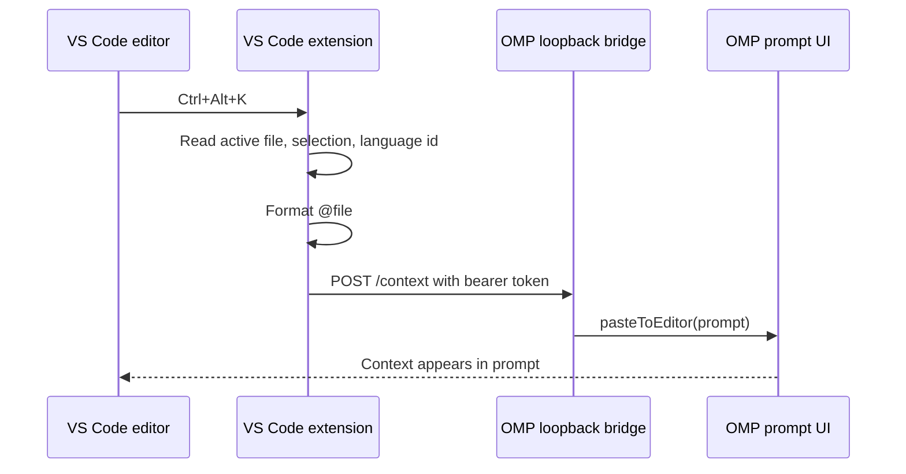

# Concepts

## Intent

**WHY this document exists:** The bridge spans two plugin systems. Future changes need to preserve which side owns editor state, prompt state, and transport security.

**WHAT this document produces:** A compact map of the concepts, request flow, data contract, and known limits.

**Decision Rules:**
- **Editor facts come from VS Code:** Current file, cursor, selection, selected text, and language id are captured by the VS Code extension only.
- **Prompt mutation happens in OMP:** OMP owns the live prompt editor, so prompt insertion uses an OMP runtime extension.
- **Local bridge, not public API:** The HTTP server binds to `127.0.0.1` and requires the token written by the running OMP extension.
- **Inline first:** Default to stale-safe `@file#LxCy-LxCy` plus selected text so OMP receives the exact bytes even if the file changes before the agent reads it. Reference-only mode stays available as the compact saved-file optimization.

## Problem shape

Claude Code and OpenCode feel integrated because the IDE extension knows the editor selection and the agent UI knows how to append to its prompt. OMP has the agent-side extension API, but VS Code still needs a separate extension to read selected text.

This repo is therefore two integrations in one package:

1. VS Code extension: registers `OMP Context: Insert Editor Context` for minimal file/selection context and `OMP Context: Insert Agent Handoff Packet` for an explicit bounded Markdown handoff.
2. OMP extension: starts a loopback bridge and inserts received prompt text into the OMP prompt.

## Runtime flow



## Data contract

The VS Code extension posts JSON to `/context`:

```json
{
  "prompt": "@src/example.ts#L7C17-L9C20 "
}
```

Only `prompt` is sent. VS Code owns editor inspection and packet assembly; OMP only needs the text to paste. Rich handoff packets still use this same transport shape.
## Content modes and handoff packets

- `inline`: default. Sends `@file#LxCy-LxCy ` plus a fenced copy of the selected text, making ordinary selections stale-safe for active editing, unsaved buffers, and generated files. Handoff packets still cap total output with `ompContext.handoffMaxBytes`.
- `reference`: sends only `@file#LxCy-LxCy `. Smaller prompt for saved workspace files because OMP can inspect the file directly.
- Agent handoff packet: default normal shortcut mode, or the separate handoff command. It wraps the active editor context with only non-empty extras: workspace root and capped diagnostics. Empty optional sections are omitted.

Use the default `agentHandoff` + `inline` pair for hands-off agent work. Use `editorContext` for a lower-overhead packet shape, `reference` for lower selected-text token use, or both for the smallest file-reference-only fallback.


## Prompt repaint compatibility

This plugin's documented support floor is OMP `16.3.7` or newer. OMP PR [can1357/oh-my-pi#4342](https://github.com/can1357/oh-my-pi/pull/4342) shipped there and fixes the old stale prompt frame by calling `requestRender()` after extension `pasteToEditor` / `setEditorText` mutations. The bridge still keeps a small `setEditorText` append fallback for hosts without `pasteToEditor`; it no longer owns repaint compatibility for pre-16.3.7 OMP.

## State file

On session start, the OMP extension writes:

```text
~/.omp/agent/editor-context-bridge.json
```

The file contains:

- `endpoint`: loopback URL chosen by OMP.
- `token`: random bearer token required for `/context`.
- `pid`: OMP process id for debugging stale state.
- `instanceId`: random id for the running OMP terminal bridge.
- `version`: installed plugin package version.
- `updatedAt`: timestamp for diagnosing stale state.

The VS Code setting `ompContext.endpoint` overrides discovery when needed.

## Multiple terminals

Multiple OMP terminals can run the plugin at the same time. Each terminal listens on a different loopback port. `session_start` keeps an existing live bridge, while `session_switch` and `/ide` explicitly route VS Code context to the current OMP terminal. Use `/ide-status` to show the endpoint and installed plugin version.

### Experimental Linux terminal focus routing

On Linux, the OMP-side **Claim IDE context on focus** plugin setting and `--claim-ide-context-on-focus` flag are disabled by default. When the runtime exposes terminal-focus reporting and the terminal emits xterm DECSET 1004 focus-in, the focused OMP instance force-claims the same state file. This is a Linux capability-based feature: no terminal-emulator, desktop, PID, or VS Code API detection is involved. Focus-out does nothing; unsupported Linux transports retain `/ide` routing. The setting is inert outside Linux.

Terminal multiplexers must forward xterm focus reports to OMP for automatic claiming; otherwise the feature remains inactive and `/ide` is the manual route.

## Shortcut semantics

OpenCode documents `Ctrl+Alt+K` / `Cmd+Alt+K` as a file-reference insertion shortcut. Claude Code documents `Alt+K` / `Option+K` as **Insert @-Mention Reference** and also exposes selected text automatically.

This extension chooses OpenCode's chord because the request named `Ctrl+Alt+K`, and it preserves Claude/OpenCode's safer behavior: insert context into the prompt, do not auto-submit by default.

## Limits

- This is not full automatic IDE context awareness. It sends context when a command is run.
- Handoff packets include VS Code diagnostics only at command time and only when present; terminal output, live LSP state, visible editor tabs, and git diff summaries are not sent.
- Handoff packets may include local paths and diagnostic text. The formatter redacts obvious secret-looking diagnostic values, but the user remains the privacy boundary before submitting the prompt.
- The VS Code command requires editor focus because VS Code keybindings with `editorTextFocus` should not steal `Ctrl+Alt+K` from OMP or terminals.
- Multiple running OMP sessions share one active state file. Use `/ide` when you need to target a specific terminal explicitly.
